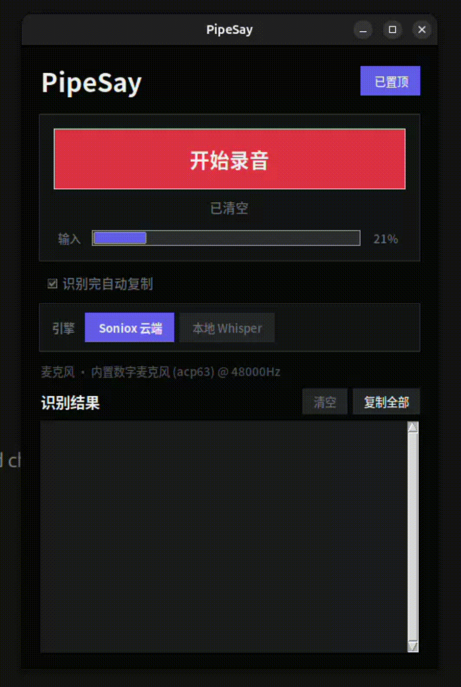
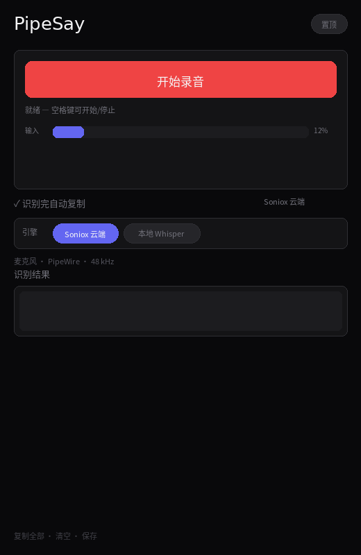
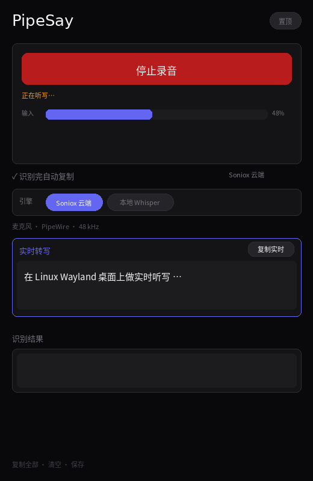
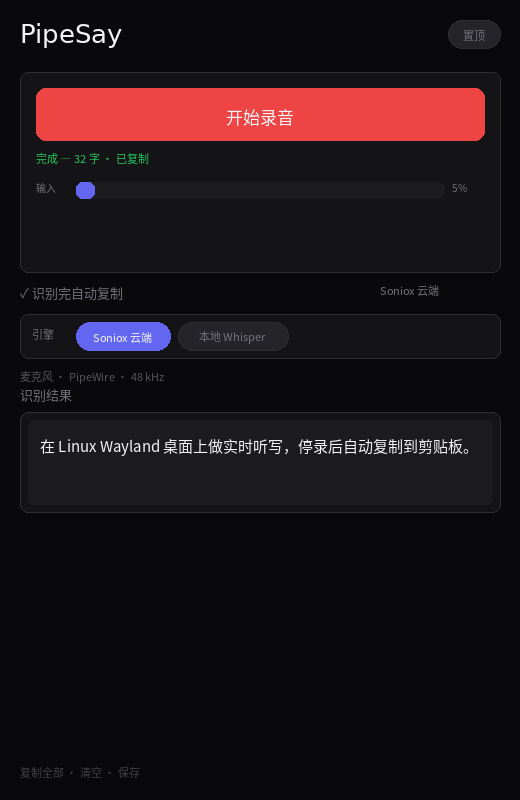

# PipeSay

**Speak on Linux. See words land.**

PipeSay 是一款面向 Linux 桌面的实时语音转文字工具：对着麦克风说话，文字即时出现在窗口里；停录定稿，自动复制到剪贴板。名字里的 **Pipe** 来自日常用的 **PipeWire**——在 Wayland 桌面上，把声音顺畅地「说」进你的工作流。

<p align="center">
  
</p>

---

## 界面一览

| 就绪 | 实时转写（Soniox RT） | 停录定稿 · 自动复制 |
|:---:|:---:|:---:|
|  |  |  |
| 麦克风电平监控；空格开始/停止 | 上方 **实时转写** 区流式出字；Wayland 下复制走 `wl-copy` | 下方 **识别结果** 定稿；勾选后自动进剪贴板 |

**技术要点（对应上图）：**

- **输入链路**：PipeWire 采集 → 重采样 16 kHz → Soniox WebSocket 实时 token
- **UI 分区**：`live_frame` 只显示进行中的 partial/final；`text_area` 只追加停录后的定稿行
- **会话隔离**：每次录音新 `_rt_token`，避免上一轮 WebSocket 回调污染当前 UI
- **Wayland**：停录复制与「复制实时」在 Wayland 下同时写 Tk 剪贴板并调用 `wl-copy`（Cursor / 浏览器里请 Ctrl+V）

首屏 GIF 为实机录屏（`docs/assets/demo-real.gif`）。三态截图与 banner：`.venv/bin/pip install pillow && .venv/bin/python scripts/generate_readme_assets.py`。更新 GIF：`ffmpeg -i 录屏.webm -vf "fps=12,scale=960:-1" -y docs/assets/demo-real.gif`

---

## 为什么做这个项目？

听写并不新鲜，Whisper、各类云端 API、系统听写早就存在。但在 **Linux + Wayland** 上，我仍想要一个：

- 常驻小窗、**实时出字**（不是录完再等）
- 停录即定稿、**一键复制**（Wayland 下会同时调用 `wl-copy`）
- 自己掌控 UI 和快捷键，而不是绑死在某个桌面环境
- 拖动手柄等实验功能放在 **Lab 分支**，不拖累稳定版

PipeSay 不是「世界上第一个 STT」，而是 **按我自己的键盘习惯打磨出来的听写工具**。稳定版每天在用；踩过的坑（麦克风 `-32768`、录音卡顿、状态栏盖住按钮反馈）都写进了代码和标签里。

---

## 快速开始

**推荐直接使用 `master` 或最新稳定标签 `v1.4-stable`。**

```bash
git clone https://github.com/metahubaifeel/pipesay.git
cd pipesay
# 默认已在 master；或锁定版本：
# git checkout v1.4-stable

python3 -m venv .venv
.venv/bin/pip install -r requirements.txt

# Soniox API Key（实时转写，需在 soniox.com 注册，按量计费）
echo "你的KEY" > ~/.soniox_key

chmod +x run.sh install-desktop.sh
./run.sh
```

**应用菜单：** `./install-desktop.sh`（自动写入你本机 clone 路径，无需手改 desktop 文件）

Wayland 用户请安装 `wl-copy`（通常来自 `wl-clipboard` 包），否则部分应用（Cursor、浏览器）里 Ctrl+V 可能拿不到剪贴板。

### 可选：本地 Whisper

```bash
.venv/bin/pip install -r requirements-local.txt
```

### Lab 版（拖放实验）

`requirements-lab.txt` 与 `run-lab.sh` **仅在 Lab 分支**，请先切换分支：

```bash
git fetch origin experiment/drag-drop
git checkout experiment/drag-drop   # 或标签 v1.4-lab
.venv/bin/pip install -r requirements-lab.txt
./run-lab.sh
./install-desktop.sh
```

Lab 与稳定版 PID / 日志独立，可同时运行。

---

## 分支与标签

| 分支 / 标签 | 说明 |
|-------------|------|
| **`master`** / **`v1.4-stable`** | 稳定版，日常推荐（PipeSay rebrand + Wayland 剪贴板） |
| `experiment/drag-drop` / **`v1.4-lab`** | Lab：实时区拖动手柄 |
| `v1.3-stable` / `v1.3-lab` | rebrand 前快照（Coco Dictation 时代），仅作历史参考 |
| `v1.0.0` | 首次以 PipeSay 名义公开发布 |

---

## 环境

- Linux（Wayland 或 X11）
- Python 3.10+
- 麦克风（PipeWire / PulseAudio）
- [Soniox](https://soniox.com/) API Key（实时云端转写，需联网，按服务商计费）
- Wayland 推荐：`wl-clipboard`（提供 `wl-copy`）

### 已知限制

- **麦克风路由** 在部分 ACP 声卡（如 `hw_acp63`）上做过验证；其他机器走 PipeWire 默认设备，表现因硬件而异。
- **识别失败时** 可能将调试 WAV 写入 `~/.local/share/pipesay/`（仅本地，注意隐私）。
- **实时转写依赖 Soniox 云端**；本地 Whisper 为可选离线补充，首次加载较慢。
- 勿误跑 `revert-ui.sh`：会把 `dictation.py` 回退到很旧的 `v1.1-stable` UI。

---

## 自检

```bash
.venv/bin/python dictation.py --test-mic 3
.venv/bin/python dictation.py --test-rt-e2e    # 需要 ~/.soniox_key
.venv/bin/python dictation.py --test-ui        # 无 key 可跑
```

CI 在 push 时自动跑 `--test-ui`（见 `.github/workflows/ui-smoke.yml`）。

---

## License

MIT — 见 [LICENSE](LICENSE)。

---

## Launch / 自媒体

发即刻、V2EX、知乎、小红书等：文案 + 配图清单见 **[docs/LAUNCH.md](docs/LAUNCH.md)**（含 `launch-banner.png` / `launch-square.png`）。

---

*Built on Linux, for people who type with their voice.*
